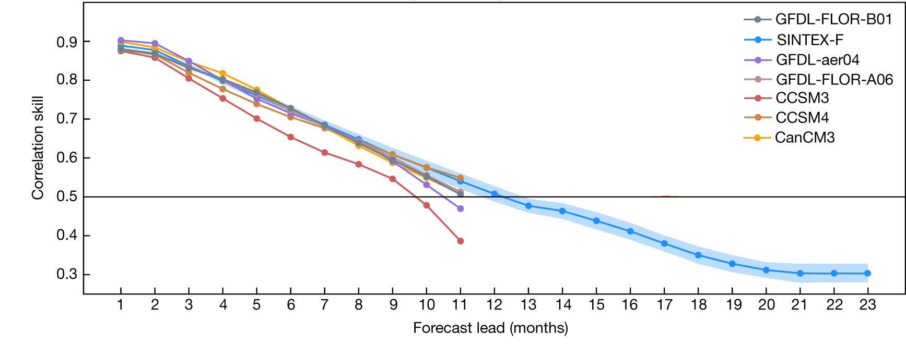

# ENSO Dynamics 

## What is ENSO?

El Niño–Southern Oscillation (ENSO) is an irregular periodic variation (3-7 years) in sea surface temperatures (SST) over the tropical eastern Pacific Ocean, affecting global and regional climate and extremes. There are three phases of ENSO: El Niño (warm phase), La Niña (cold phase), and neutral/normal phase. 

- El Niño:  A warming of the ocean surface, or above-average SST, in the central and eastern tropical Pacific Ocean.
- La Niña: A cooling of the ocean surface, or below-average SST, in the central and eastern tropical Pacific Ocean. 
- Neutral: No warming or cooling of the ocean surface. Often tropical Pacific SSTs are generally close to average.  

 

Figure 1. Diagram of ENSO phases and assoicated dynamics during El Niño, normal, and La Niña conditions. Source: NOAA/PMEL/TAO Project Office, Dr. Michael J. McPhaden, Director. 

## What is the Niño index?

## How ENSO impacts global and regional climate?

## ENSO prediction skills in current climate models 

Despite of advances in climate modeling, multi-year ENSO prediction remains a challenge. Uncertainty in model initialization, incomplete understanding and imperfect reproduction of the climate variability, as well as insufficient computational resources, limits the practical predictability of climate system. Research has suggested that ENSO can be skillfully predictable with lead times of 6-12 months. Multi-year ENSO prediction particularly with lead times over one year is problematic. 

 
Figure 3. ENSO correlation skills in several dynamical climate models. Correlation skills over 0.5 are generally considered skillful. This figure is modified from Ham et al., 2019.

