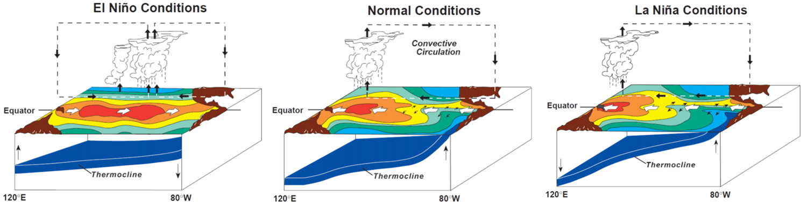

# ENSO Dynamics 

## 1. What is ENSO?

El Niño–Southern Oscillation (ENSO) is an irregular periodic variation (3-7 years) in sea surface temperatures (SST) over the tropical eastern Pacific Ocean, affecting global and regional climate and extremes. There are three phases of ENSO: El Niño (warm phase), La Niña (cold phase), and neutral/normal phase. 

- El Niño:  A warming of the ocean surface, or above-average SST, in the central and eastern tropical Pacific Ocean.
- La Niña: A cooling of the ocean surface, or below-average SST, in the central and eastern tropical Pacific Ocean. 
- Neutral: No warming or cooling of the ocean surface. Often tropical Pacific SSTs are generally close to average.  

 
Figure 1. Diagram of ENSO phases and assoicated dynamics during El Niño, normal, and La Niña conditions. Source: NOAA/PMEL/TAO Project Office, Dr. Michael J. McPhaden, Director. 

## 2. How to determine an El Niño event?
Several indices have been used to determine the phases of ENSO, all of which are calculated based on SST anomalies averaged aross specific regions in the tropical Pacific. The Niño 3.4 (N34) index is one of the most commonly accepted ENSN indices in the climate community. N34 is estimated as the area-averaged-SST anomalies around [5N-5S, 170W-120W], which is the operational definition used by NOAA. An El Niño event is recognized when N34 is equal to or greater than +0.5°C, while a La Niña event is classified when N34 is equal to or smaller than -0.5°C.    

 

Figure 2.  Niño index of ENSO. Source: [NOAA National Centers for Environmental Information](https://www.ncdc.noaa.gov/teleconnections/enso/indicators/sst/). 

## 3. How ENSO impacts global and regional climate?
ENSO arises from changes across the tropical Pacific Ocean and affects regional and global climate dependent on warm or cold phases of ENSO events. The figure below shows an exmaple of how El Niño impacts global climate during winter seasons. 

 

Figure 3. Impacts of El Niño on global climate during winter seasons. Source: [NOAA National Weather Service](https://www.weather.gov/jetstream/enso_impacts) 

## 4. ENSO prediction skills in current climate models 

Despite of advances in climate modeling, multi-year ENSO prediction remains a challenge. Uncertainty in model initialization, incomplete understanding and imperfect reproduction of the climate variability, as well as insufficient computational resources, limits the practical predictability of climate system. Research has suggested that ENSO can be skillfully predictable with lead times of 6-12 months. Multi-year ENSO prediction particularly with lead times over one year is problematic. 

 
Figure 3. ENSO correlation skills in several dynamical climate models. Correlation skills over 0.5 are generally considered skillful. This figure is modified from Ham et al., 2019.

